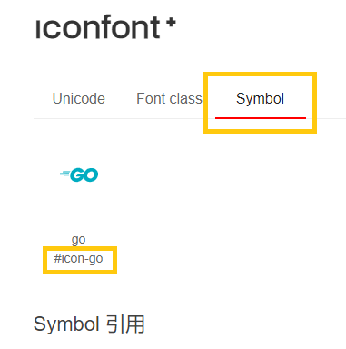

# 在 vuetify 项目中使用自定义 iconfont 图标

工程中需要引入 material design icon 之外的图标。google 了一下发现几乎没有相关教程，特将解决问题的过程记录下来，也算帮其他人趟个坑吧。

## 初步使用

1) 从 [iconfont][iconfont] 下载图标。这里需要留意一下图标名，之后引用的时候会用到。
下载解压后打开 `demo_index.html`。点击 `Symbol` 处可以看到以下内容。

可以看到笔者下载了一个叫 go 的图标，它的类名是 `#icon-go`。

引用一下后面的教程。快速过一下就好，后面会用到。

> 第一步：引入项目下面生成的 symbol 代码：
> ``` html
> <script src="./iconfont.js"></script>
> ```
> 第二步：加入通用 CSS 代码（引入一次就行）：
> ``` html
> <style>
> .icon {
>   width: 1em;
>   height: 1em;
>   vertical-align: -0.15em;
>   fill: currentColor;
>   overflow: hidden;
> }
> </style>
>```
> 第三步：挑选相应图标并获取类名，应用于页面：
>``` html
>  <svg class="icon" aria-hidden="true">
>    <use xlink:href="#icon-xxx"></use>
>  </svg>
>```

2) 根据 [vuetify 官网][vuetify] 提供的教程，修改 `vuetify.js` 文件。
示例代码如下：

``` js
// src/plugins/vuetify.js

import Vue from 'vue'
import Vuetify from 'vuetify/lib'
import IconComponent from '@/Components/IconComponent.vue'

Vue.use(Vuetify)

export default new Vuetify({
  icons: {
    values: {                       // 所有自定义图标，以一个大对象的形式提供
      go: {                         //
        component: IconComponent,   // 如果组件全局注册, 您在这里可以使用字符串
        props: { name: 'go' },      // 如果需要您可以传递 props 到组件
      },
    },
  },
})
```

上述代码在 vuetify 中绑定了一个名为 go 的图标。图标由自定义的 `IconComponent` 组件提供。

3) 接下来创建这个组件。在 `src/component/` 新建一个 `IconComponent.vue` 文件。
将下载图标时提供的代码以组件的形式写出来。内容如下（注意笔者使用的是 sass 而不是 css）：

``` html
<!-- src/component/IconComponent.vue -->

<template>
  <!-- 教程第三步 引用图标名对应的类名 -->
  <svg class="icon-component" aria-hidden>
    <use :xlink:href="`#icon-${name}`"></use>
  </svg>
</template>

<script>
// 教程第一步
import '@/assets/font/iconfont.js'

// IconComponent 自定义图标组件 不需要直接使用
// 示例: <v-icon> $vuetify.icon.go <v-icon>
export default {
  name: 'IconComponent',
  props: {
    name: { type: String, required: true }
  },
}
</script>

<style lang="sass" scoped>
// 教程第二步
// 改掉默认类名 别和 vuetify 冲突就好
.icon-component
    width: 1em
    height: 1em
    vertical-align: -0.15em
    fill: currentColor
    overflow: hidden
</style>
```
4) 拷贝下载到的 `iconfont.js` 到项目目录下。在上例中笔者使用的是 `src/assets/font/`，也就是上面 “教程第一步” 配置的位置。

到此为止 iconfont 自定义图标的初步导入已经完成了。我们可以像 vuetify 提供的 [icon 示例][vuetify-icon] 那样使用自定义图标了。注意我们提供的 `IconComponent` 组件依然可用。但 [icon 组件][icon] 还支持其他功能，我们也就没必要使用这个组件了。

## 提取配置

上面的导入方式有一个缺点，每引入一个图标就需要在 `src/plugins/vuetify.js` 中添加一个用于描述该图标的对象。导入图标越多，vuetify.js 文件就越臃肿。为了代码的可读性，需要将图标描述抽取出来。当然，也可以使用自定义的 `IconComponent` 组件替代 `<v-icon>` 组件，毕竟它不需要手动配置类名。这就看个人取舍了。

提取配置也很简单。新建 `src/plugins/iconfont.js`，内容如下：

``` js
import IconComponent from "@/components/IconComponent.vue";

const icons = [
    'go',
    'vue',
    'yarn',
    'npm',
]

export const Iconfont = icons.reduce((prev, name) => {
    prev[icon] = {
        component: IconComponent,
        props: { name },
    }
    return prev
}, {})
```

上面代码的思路源于 github 上 lesonky 发布的[这篇文章][github]。总体上来说就是将
``` js
const icons = [
    'go',
    'vue',
    'yarn',
    'npm',
    ……
]
```
转换成
```js
{
    go: {
        component: IconComponent,
        props: { name: 'go' },
    },
    vue: {
        component: IconComponent,
        props: { name: 'vue' },
    },
    ……
}
```

最后，将这个大对象导出到 `src/plugins/vuetify.js` 即可。代码对比如下：

``` js
// src/plugins/vuetify.js

/* 导入前 */
import Vue from 'vue'
import Vuetify from 'vuetify/lib'
import IconComponent from '@/Components/IconComponent.vue'

Vue.use(Vuetify)

export default new Vuetify({
  icons: {
    values: {                       // 所有自定义图标，以一个大对象的形式提供
      go: {                         //
        component: IconComponent,   // 如果组件全局注册, 您在这里可以使用字符串
        props: { name: 'go' },      // 如果需要您可以传递 props 到组件
      },
    },
  },
})

/* 导入后 */
import Vue from 'vue';
import Vuetify from 'vuetify';
import { Iconfont } from "./iconfont.js";

Vue.use(Vuetify)

export default new Vuetify({
    icons: { values: Iconfont }, // <- 这里和 github 上那篇文章不同
})
```
现在配置图标就能稍微方便一点了。更新图标之后记得更新一下 `iconfont.js` 文件。就可以像这样使用自定义图标了。

``` html
<!-- 直接使用 注意单引号 -->
<v-icon v-text="'$go'" />

<!-- 绑定变量法 注意反引号 -->
<v-icon v-text="`$${xx.iconName}`" />
```

[iconfont]:https://www.iconfont.cn
[vuetify]:https://vuetifyjs.com/zh-Hans/features/icon-fonts/#section-7ec44ef656fe6807
[vuetify-icon]:https://vuetifyjs.com/zh-Hans/features/icon-fonts/#section-53ef590d7528768481ea5b9a4e4956fe6807
[icon]:https://vuetifyjs.com/zh-Hans/components/icons/
[github]:https://gist.github.com/lesonky/d8222493c7e2add2e7dd1942f92ed5ae#%E7%84%B6%E5%90%8E%E5%86%8D%E5%B0%86iconfont%E6%9C%89%E5%85%B3%E7%9A%84%E4%BB%A3%E7%A0%81%E7%BB%84%E7%BB%87%E8%B5%B7%E6%9D%A5